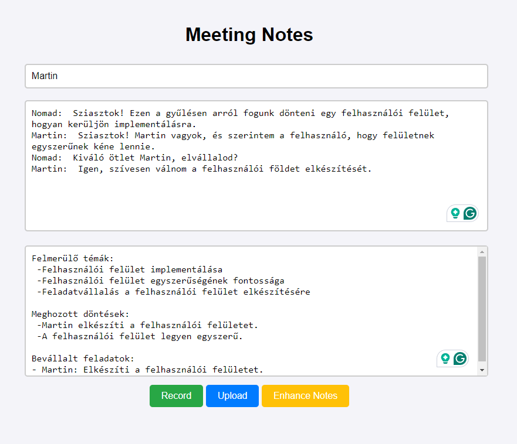

# Meeting Transcriber Exercise

Homework for the Budapest University of Technology and Economics: Prompt Engineering (VITMAV82) subject

## Homework Listing

**Homework ID:** 1

**Description:** 
Web application that allows a moderator to record the speeches of people present at a live meeting and formats speeches using a large language model to generate a note highlights.

## Authors

- Hegedűs András: \[nomad-at-you\] Transcription and web application
- Farkas Martin: \[BlackLight54\] Transcription enhancement and prompting research

## Description of Solution

Our solution is available on GitHub: https://github.com/BlackLight54/meeting-transcriber-exercise

### UI

### Architecture

We planned the architecture and data flow for our solution to efficiently manage meeting transcriptions and speaker prioritization.

1. **Audio Recording and Transcription:** 
   - The meeting audio is recorded by the moderator recording the speeches of each participant in the meeting individually.
   - The audio files are converted to text using a text-to-speech model.

2. **Text Processing:**
   - The transcribed text is processed by a language model to correct any errors and format the text into a standardized form suitable for prompting.

3. **Meeting Minutes Generation:**
   - The corrected and formatted text, along with optional meeting data, is fed to a language model with a prompt to generate meeting minutes.
   - The minutes are structured based on a methodology we have successfully used in past projects.

4. **Meeting decisions and action items:**
   - The generated minutes are analyzed to identify decisions made and action items assigned during the meeting.
   - These are extracted and presented in a structured format for easy reference.

#### Faster-Whisper

**Repository:** https://github.com/SYSTRAN/faster-whisper

Faster-Whisper is a highly efficient implementation of OpenAI's Whisper model, optimized for speed and performance. This model is specifically designed to handle speech-to-text conversion tasks with an emphasis on real-time processing. It supports multiple languages, including Hungarian, and incorporates speaker diarization to distinguish between different speakers in an audio recording.

- **Model Size:** We used the "medium" model, which balances accuracy and speed, making it suitable for our application where prompt transcription is essential.
- **Device:** The model runs on CUDA-enabled devices using float16 precision to leverage GPU acceleration for faster processing.
- **Beam Size:** We configured the model with a beam size of 7, enhancing the quality of the transcription by considering multiple hypotheses during decoding.

The Faster-Whisper model transcribes audio files by splitting them into segments, each containing the spoken words. These segments are then combined to form a coherent transcript. 

#### OpenAI

**API:** https://openai.com/api/

OpenAI's language models, specifically those in the GPT-4 series, are employed for text enhancement and summarization tasks in our application. These models are known for their powerful natural language understanding and generation capabilities, making them ideal for processing and refining meeting transcripts.

- **Model Used:** We utilized the "gpt-4o" model, which is tailored for conversational contexts and capable of understanding complex inputs to generate detailed and coherent outputs.
- **API Integration:** The OpenAI API allows us to send transcribed text and receive enhanced summaries in real-time, facilitating the creation of structured meeting minutes.

*Warning:* The OpenAI API is a paid service, and users must have an API key to access the model. Add it as an environment variable to run the application.

### Prompting Techniques

- **Prompting Notebook:** `./prompting.ipynb`
- **Techniques Used:**
  - One- and Few-shot prompting
  - System and user prompts
  - Separation of actions (Prompt-chaining, Chain-of-thought prompting)

## Learnings

Through this project, we gained practical experience in integrating speech-to-text solutions with diarization capabilities and leveraging language models for text correction, formatting, and summarization. Additionally, we applied advanced prompting techniques to enhance the accuracy and coherence of the generated meeting minutes.

## Solution

Our solution is implemented as a Flask web application that allows users to upload audio files, transcribe them, and enhance the notes by summarizing topics discussed, decisions made, and action items assigned during the meeting. The application is designed to support multiple languages, with a focus on Hungarian.

### Key Components

1. **Flask Application:**
   - Handles file uploads and processes audio data.
   - Provides endpoints for transcription and enhancement of meeting notes.

2. **Whisper Model:**
   - Utilized for transcribing audio files into text with speaker identification.

3. **OpenAI Integration:**
   - Used to enhance transcriptions by summarizing topics, decisions, and action items.

4. **File Handling:**
   - Transcriptions are stored in a text file (`notes.txt`), which is updated with each new upload.

### Example Workflow

1. **Recording of Speeches:**
   - The moderator records the speeches of participants in the meeting, adding their names to the list of speakers and ensuring each speaker is captured separately.
2. 
3. **Transcription Storage:**
   - The transcriptions are appended to `notes.txt` with the speaker's name.

3. **Enhance Notes:**
   - The transcriptions are formatted and sent to the OpenAI model to generate summaries of topics, decisions, and action items.

4. **Output:**
   - The enhanced notes are returned in an easy-to-read format, highlighting key points discussed during the meeting.

By following this structured approach, we ensure that the meeting minutes are comprehensive, accurately reflecting the discussions and outcomes of the meeting.

### Future Enhancements Opportunities

- Subscribable moderation list for group members to receive notifications when their turn is up
- More enhancement features for the meeting notes, such as sentiment analysis and keyword extraction

